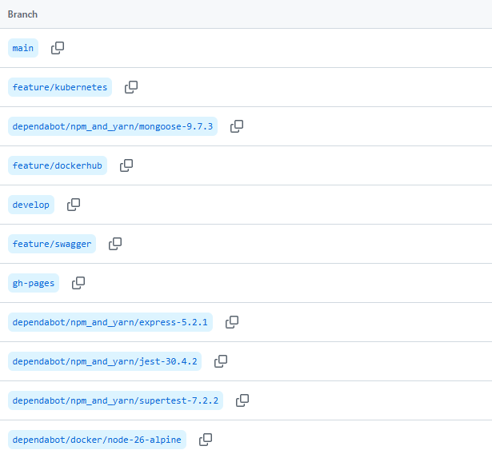
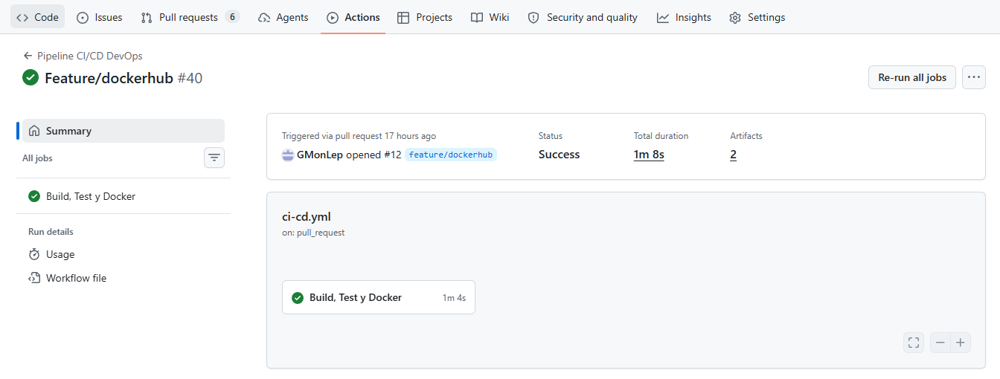
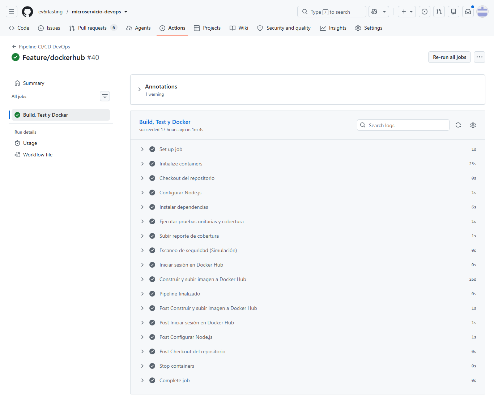
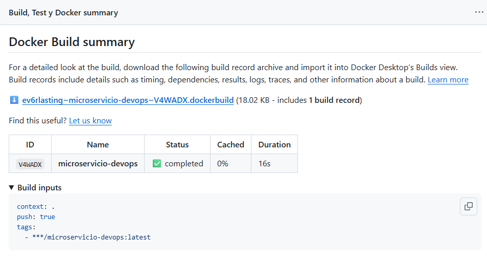
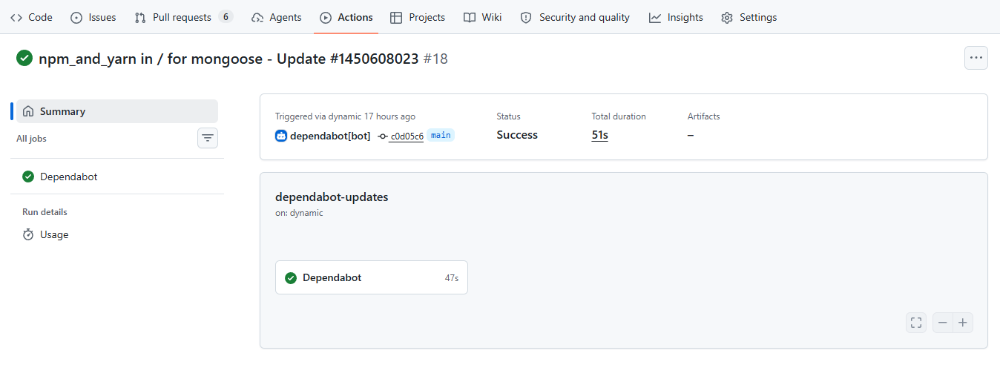
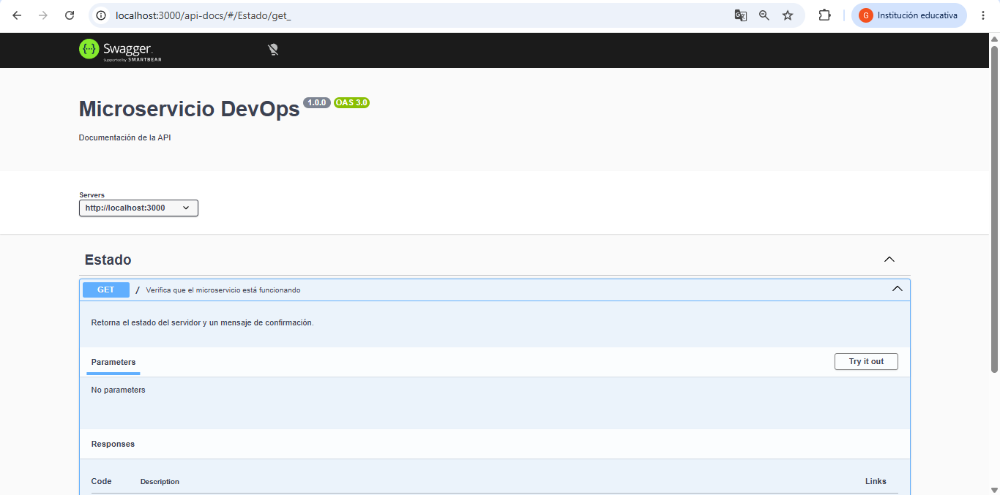
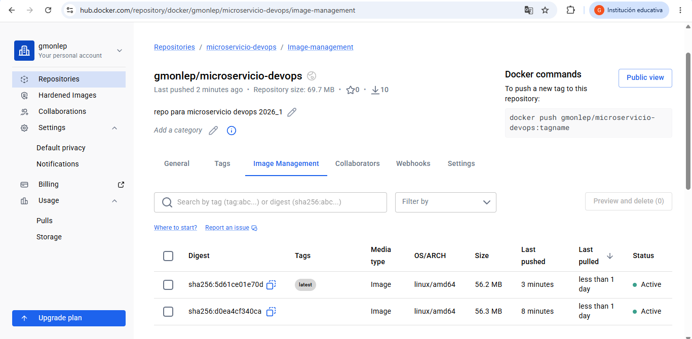
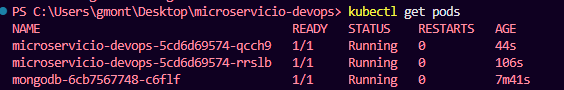
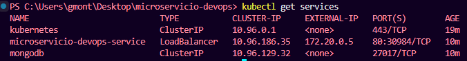

# Evaluación Transversal — Ingeniería DevOps

Este documento presenta la evidencia técnica del desarrollo del proyecto durante la asignatura de Ingeniería DevOps, describiendo la implementación del flujo de integración continua, la contenerización del microservicio, la automatización mediante GitHub Actions y el despliegue utilizando tecnologías de contenedores.

---

# Integrantes del Proyecto

* **Integrante 1:** Raul Gonzalez
* **Integrante 2:** Génesis Montero
* **Sección:** 003D

---

# Estrategia de Branching

Durante el desarrollo del proyecto se utilizó una estrategia de ramas inspirada en Git Flow para mantener un desarrollo organizado y facilitar la integración continua.

## Rama `main`

Contiene únicamente versiones estables del proyecto y representa el código listo para producción.

## Rama `develop`

Corresponde a la rama de integración donde se incorporan las nuevas funcionalidades antes de ser publicadas en `main`.

## Ramas `feature/*`

Cada nueva funcionalidad fue desarrollada en una rama independiente para facilitar el trabajo colaborativo y la revisión mediante Pull Requests.

Ejemplos utilizados durante el desarrollo:

- feature/swagger
- feature/kubernetes

Las integraciones fueron realizadas mediante Pull Requests hacia `develop` y posteriormente hacia `main`, permitiendo validar el funcionamiento del pipeline antes de aceptar los cambios.

### Evidencia



---

# Flujo General del Pipeline (CI/CD)

El flujo implementado automatiza las principales actividades del ciclo DevOps.

```text
Push / Pull Request
        │
        ▼
GitHub Actions
        │
        ▼
Instalación de dependencias
        │
        ▼
Pruebas unitarias (Jest)
        │
        ▼
Reporte de cobertura
        │
        ▼
Escaneo de seguridad (SAST Simulado)
        │
        ▼
Construcción de imagen Docker
        │
        ▼
Publicación automática en Docker Hub
```

### Evidencia



---

# Arquitectura del Proyecto

La aplicación está compuesta por un microservicio desarrollado con Node.js y Express que utiliza MongoDB como base de datos.

Durante el desarrollo se utilizaron las siguientes tecnologías:

- Node.js
- Express
- MongoDB
- Docker
- Docker Compose
- GitHub Actions
- Docker Hub
- Swagger UI
- Kubernetes
- Jest
- Supertest
- Dependabot

Arquitectura general:

```text
Cliente

↓

Microservicio Express

↓

MongoDB
```

Para el despliegue con Kubernetes:

```text
Cliente

↓

Service (LoadBalancer)

↓

Deployment (2 réplicas)

↓

Microservicio Node.js

↓

MongoDB Deployment

↓

MongoDB Service
```

---

# Contenerización con Docker (IE2)

El proyecto fue contenerizado mediante Docker utilizando un archivo `Dockerfile`, permitiendo ejecutar el microservicio de manera independiente del sistema operativo.

Posteriormente se incorporó un archivo `docker-compose.yml` para levantar conjuntamente el microservicio y la base de datos MongoDB.

Se configuró además un mecanismo de **Healthcheck** para garantizar que la aplicación espere a que MongoDB esté completamente disponible antes de iniciar.

### Evidencia

*(Insertar captura de Docker Desktop mostrando ambos contenedores ejecutándose.)*

---

# Automatización con GitHub Actions (IE4)

Se implementó un pipeline de Integración Continua mediante GitHub Actions.

El workflow realiza automáticamente las siguientes tareas:

- Descarga del código fuente.
- Configuración de Node.js.
- Instalación de dependencias mediante `npm ci`.
- Ejecución de pruebas unitarias.
- Generación del reporte de cobertura.
- Simulación de análisis SAST.
- Construcción automática de la imagen Docker.
- Publicación automática de la imagen en Docker Hub cuando todas las pruebas son exitosas.

Además, el pipeline se ejecuta automáticamente al realizar:

- Push sobre `develop`.
- Push sobre `main`.
- Pull Request hacia `main`.

### Evidencia



---

# Pruebas Automatizadas (IE7)

Para validar el funcionamiento del microservicio se desarrolló una suite de pruebas utilizando:

- Jest
- Supertest

Las pruebas se ejecutan automáticamente durante cada ejecución del pipeline y generan un reporte de cobertura almacenado como artefacto de GitHub Actions.

Durante el desarrollo también se corrigieron problemas relacionados con procesos abiertos de Node.js para evitar bloqueos en la ejecución automática de Jest dentro del pipeline.

### Evidencia



---

# Seguridad del Proyecto (IE8)

Como parte de la integración continua se incorporaron mecanismos básicos de seguridad.

## Dependabot

Se configuró Dependabot para revisar automáticamente:

- Dependencias NPM.
- Imagen base utilizada por Docker.

Generando Pull Requests automáticos cuando existen actualizaciones disponibles.

## Escaneo SAST

El pipeline incorpora una etapa de simulación de análisis estático de código para representar un proceso de revisión de seguridad previo a la construcción de la imagen Docker.

### Evidencia



---

# Documentación de la API con Swagger

Se incorporó Swagger UI para documentar los endpoints disponibles del microservicio.

La documentación queda disponible automáticamente en:

```
http://localhost:3000/api-docs
```

Esta documentación facilita las pruebas manuales de la API y entrega información sobre las rutas disponibles y las respuestas esperadas.

### Evidencia



---

# Publicación Automática en Docker Hub

Una vez superadas todas las pruebas del pipeline, GitHub Actions publica automáticamente la imagen Docker en Docker Hub.

Repositorio utilizado:

```
gmonlep/microservicio-devops
```

Etiqueta publicada:

```
latest
```

Esto permite distribuir el microservicio mediante imágenes versionadas listas para ser desplegadas.

### Evidencia



---

# Despliegue en Kubernetes (IE10)

Como parte del proceso de despliegue continuo se implementó un entorno de producción simulado utilizando Kubernetes mediante Docker Desktop.

Para ello se desarrollaron los siguientes manifiestos:

- `mongo-deployment.yaml`
- `mongo-service.yaml`
- `app-deployment.yaml`
- `app-service.yaml`

Estos recursos permiten desplegar:

- Un Deployment para MongoDB.
- Un Service interno para MongoDB.
- Un Deployment con dos réplicas del microservicio.
- Un Service tipo LoadBalancer para exponer la aplicación.

El despliegue se realizó mediante:

```bash
kubectl apply -f k8s/
```

Posteriormente se verificó el correcto funcionamiento utilizando:

```bash
kubectl get pods
```

y

```bash
kubectl get services
```

obteniendo todos los Pods en estado **Running**, comprobando el funcionamiento correcto del microservicio y la comunicación con MongoDB.

### Evidencia







---

# Workflows del Repositorio

El proyecto incorpora dos workflows principales ubicados en:

```
.github/workflows/
```

## ci-cd.yml

Responsable del proceso de Integración Continua:

- Checkout del repositorio.
- Configuración de Node.js.
- Instalación de dependencias.
- Ejecución de pruebas.
- Generación del reporte de cobertura.
- Simulación de escaneo SAST.
- Construcción de la imagen Docker.
- Publicación automática en Docker Hub.

## ep02-devops-continuous-feedback.yml

Workflow proporcionado para la retroalimentación automática de la asignatura, encargado de ejecutar el proceso de evaluación definido por el equipo docente.

---

# Reflexión Final

La implementación del proyecto permitió aplicar los principales conceptos asociados a la cultura DevOps mediante la automatización de procesos que tradicionalmente eran manuales.

Entre los principales aprendizajes obtenidos destacan:

- La importancia de utilizar un modelo organizado de ramas para facilitar el trabajo colaborativo.
- La utilidad de GitHub Actions para automatizar pruebas, compilaciones y construcción de imágenes Docker.
- La utilización de Docker como mecanismo para garantizar entornos consistentes entre desarrollo y despliegue.
- La integración de Swagger para documentar y facilitar las pruebas de la API.
- La implementación de Kubernetes como plataforma para desplegar múltiples réplicas del microservicio en un entorno de producción simulado.
- La incorporación de herramientas como Dependabot para mantener actualizadas las dependencias del proyecto.

El desarrollo permitió comprender cómo la integración continua y la automatización reducen errores humanos, mejoran la calidad del software y facilitan la entrega continua de aplicaciones.

---

# Inteligencia Artificial Utilizada

Durante el desarrollo del proyecto se utilizaron herramientas de Inteligencia Artificial como apoyo técnico.

- **ChatGPT (OpenAI):** apoyo en la resolución de problemas relacionados con Git, GitHub Actions, Docker, Docker Hub, Swagger, Kubernetes y documentación técnica.
- **Gemini:** apoyo durante la implementación inicial del proyecto y consulta de configuraciones relacionadas con Docker y arquitectura DevOps.

Todas las configuraciones fueron implementadas, probadas y adaptadas manualmente antes de ser integradas al repositorio.